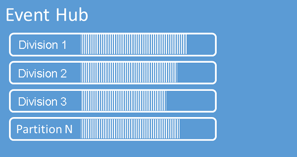

Azure Event Hubs diffuse des messages via un modèle de consommateur partitionné, dans lequel chaque consommateur lit uniquement un sous-ensemble spécifique, ou partition, du flux de messages. Ce modèle permet la mise à l’échelle horizontale pour le traitement des événements et fournit d’autres fonctionnalités de flux qui ne sont pas disponibles dans les rubriques et les files d’attente.

Une partition est une séquence ordonnée d’événements qui est conservée dans un concentrateur d’événements. Les événements les plus récents sont ajoutés à la fin de cette séquence. Une partition peut être considérée comme un « journal de validation ».

Event Hubs conserve les données pendant une durée de rétention configurée, qui s’applique à toutes les partitions du concentrateur d’événements. Les événements expirent selon une base temporelle. Vous ne pouvez pas les supprimer explicitement. Comme les partitions sont indépendantes et contiennent leur propre séquence de données, elles évoluent souvent à des vitesses différentes.

Le nombre de partitions est spécifié lors de la création du concentrateur d’événements. Il doit être compris entre 2 et 32. Le nombre de partitions n’est pas modifiable. Lorsque vous le définissez, tenez compte de la mise à l’échelle sur le long terme. Les partitions constituent un mécanisme d’organisation des données. Elles sont liées au degré de parallélisme en aval requis lors de la consommation des applications. Le choix du nombre de partitions dans un concentrateur d’événements est directement lié au nombre de lecteurs simultanés que vous prévoyez d’avoir. Si vous souhaitez augmenter le nombre de partitions au-delà de 32, contactez l’équipe Azure Event Hubs.

Vous pouvez choisir la valeur la plus élevée possible, à savoir 32, au moment de la création. N’oubliez pas que si vous avez plusieurs partitions, les événements sont envoyés à plusieurs partitions sans conserver l’ordre, sauf si vous configurez les expéditeurs pour qu’ils envoient uniquement à une partition unique à partir de la partition 32 en laissant les 31 partitions restantes. Dans le premier cas, vous devez lire les événements sur les 32 partitions. Dans le dernier cas, il n’y a pas de frais supplémentaires évidents par rapport à la configuration supplémentaire que vous devez effectuer sur l’hôte du processeur d’événements.

Les partitions sont identifiables et peuvent recevoir des données directement, mais envoyer directement à une partition n’est pas recommandé. Au lieu de cela, vous pouvez utiliser des constructions de niveau supérieur présentées dans la section [Éditeurs d’événements](../articles/event-hubs/event-hubs-features.md#event-publishers). 

Une séquence de données d’événement est incluse dans les partitions. Elle comprend le corps de chaque événement, un conteneur de propriétés défini par l’utilisateur et diverses métadonnées, telles que son décalage dans la partition et son numéro dans la séquence de flux.

Nous vous recommandons d’équilibrer 1:1 les partitions et les unités de débit pour obtenir un dimensionnement optimal. Une partition unique offre une garantie d’entrée et de sortie pouvant aller jusqu’à 1 unité de débit. Bien que vous puissiez atteindre un débit plus élevé sur une partition, les performances ne sont pas garanties. C’est pourquoi nous vous recommandons vivement de faire en sorte que le nombre de partitions dans un hub d’événements soit supérieur ou égal au nombre d’unités de débit.

Étant donné le débit total dont vous prévoyez d’avoir besoin, vous connaissez le nombre d’unités de débit nécessaires et le nombre minimal de partitions, mais combien de partitions devez-vous avoir ? Choisissez le nombre de partitions en fonction du parallélisme en aval que vous souhaitez atteindre, ainsi que de vos besoins futurs en matière de débit. Il n’y a aucun frais lié au nombre de partitions que vous avez au sein d’un hub d’événements.

Pour plus d’informations sur les partitions et le compromis entre la disponibilité et la fiabilité, consultez le [Guide de programmation de concentrateurs d’événements](../articles/event-hubs/event-hubs-programming-guide.md#partition-key) et l’article [Disponibilité et cohérence dans Event Hubs](../articles/event-hubs/event-hubs-availability-and-consistency.md).
